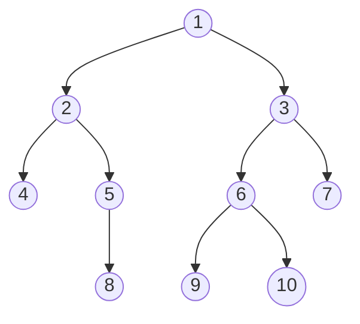
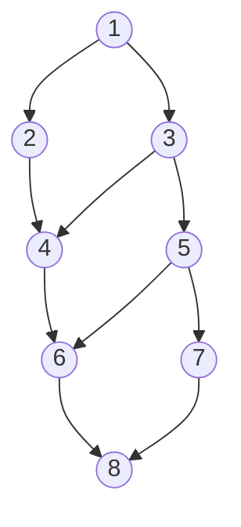
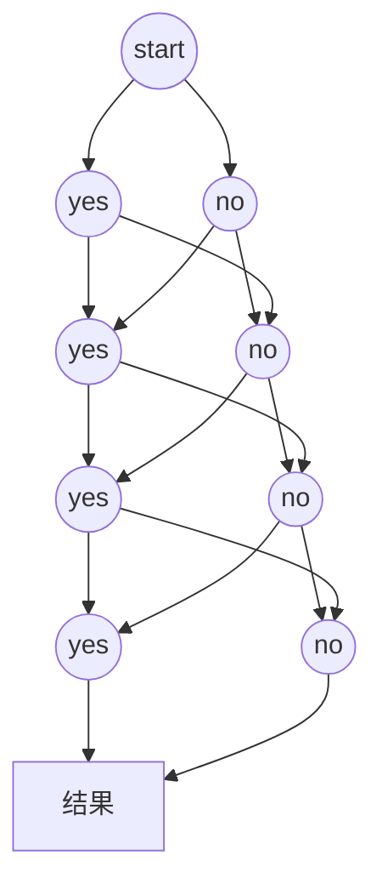

# 概述
## 概念
dfs是一种通过递归遍历图与树的较为全面的算法，应用较为广泛，在遍历到不符合规定时取消遍历并不断向前回溯  至出发位置，效率较低，目的是全面无遗漏的遍历，可以通过记忆化与剪枝进行优化。  

## 树遍历

过程解析：  



先序遍历：1.2.4.5.8.3.6.9.10.7  
dfs理解：  
进入结点1(2.3)进入子结点2(4.5)再进入孙节点4发现4是最后一个，这条路结束[1.2.4]。  
再开始退一步进入子结点2(4.5)中进入孙结点5(8)，再进入曾孙结点8发现8是最后一个，这条路结束[5.8]  
再开始，退一步5(遍历完成)，退一步2(遍历完成),退一步1(2.3)开始遍历子结点3(6.7)再进入孙结点  6(9.10)再进入9发现是最后一个，这条路结束[3.6.9]  
再开始退一步进入子节点6(9.10)出10，结束[10]  
再开始，退一步6(遍历完成)，退一步3(6.7)出7，结束[7]  

## 图遍历

|1|2|  
|:-:|:-:|  
|3|4|  
|5|6|  
|7|8|  

若要列出从1到6的所有走法（只能向上或向右移动），便得出下面的类树形结构   



由于深度优先搜索讲究深度，可以很轻易构建树形结构模型  

## 线性遍历

线性枚举所有可能，这里给一道类01背包的题来辅助说明  

<a href="http://acm.zzuli.edu.cn/problem.php?id=2733"></a>

可用以下树形结构来说明枚举情况，深度等于第i个球的枚举情况，yes表示选，no表示不选(先只枚举四种）




### 思路1：十重循环

每种小球都有取或不取两种情况，对每个小球逐个枚举即可，时间复杂度为O(2^n)  

```cpp
#include <stack>
#include <iostream>
#include <vector>
#include <algorithm>
#include <string>
#include <cstring>
#include <cmath>
#include <unordered_map>
#define rep1(i, a, n) for (int i = a; i <= n; i++)
#define rep2(i, a, n) for (int i = a; i >= n; i--)
#define mm(a, b) memset(a, b, sizeof(a))
#define elif else if
typedef long long ll;
using namespace std;
int num[10005];
int x[12];
int main()
{
    int T;
    cin >> T;
    while (T--)
    {
        mm(num, 0);
        mm(x, 0);
        int n;
        cin >> n;
        rep1(i, 0, n - 1)
                cin >>x[i],num[x[i]] = 1;
        //十重循环枚举全部情况
        rep1(a, 0, 1)
        rep1(b, 0, 1)
        rep1(c, 0, 1)
        rep1(d, 0, 1)
        rep1(e, 0, 1)
        rep1(f, 0, 1)
        rep1(g, 0, 1)
        rep1(h, 0, 1)
        rep1(i, 0, 1)
        rep1(j, 0, 1)
        {
            int sum = 0;
            sum += a * x[0] + b * x[1] + c * x[2] + d * x[3] + e * x[4] + f * x[5] + g * x[6] + h * x[7] + i * x[8] + j * x[9];
            num[sum] = 1;//可以枚举到的标记一下
        }
        rep1(i, 1, 10000)//输出没枚举过的最小的
        if (num[i] == 0)
        {
            printf("%d\n", i - 1);
            break;
        }
    }
    return 0;
}
//这里因为n最大为10所以好写，但如果n为更大的呢，明显不合适，下面就是dfs的写法
```


### 思路2：dfs

我们需要递归来帮我们明确每一个球应该做的哪个选择，但要有递归出口  

```cpp
//dfs写法1：枚举01
#include <stack>
#include <iostream>
#include <vector>
#include <algorithm>
#include <string>
#include <cstring>
#include <cmath>
#include <unordered_map>
#define rep1(i, a, n) for (int i = a; i <= n; i++)
#define rep2(i, a, n) for (int i = a; i >= n; i--)
#define mm(a, b) memset(a, b, sizeof(a))
#define elif else if
typedef long long ll;
const int int_max = 1 << 31 - 1;
using namespace std;
int a[15],flag[15];
int cnt[10010];
void dfs(int i,int n)
{
    if(i>n) //递归出口
    {
        int sum=0;
        rep1(o,1,n)
            if(flag[o]) sum+=a[o];
        cnt[sum]++;//能构成的记录一下
        return ;
    }
    //下面的是帮我们枚举第i个球是否要选
    flag[i]=0;
    dfs(i+1,n);
    flag[i]=1;
    dfs(i+1,n);
}
int main()
{
    int T;
    cin>>T;
    while(T--)
    {
        mm(cnt, 0);
        mm(a, 0);
        mm(flag, 0);
        int n;
        cin>>n;
        rep1(i,1,n) 
            cin>>a[i];
        dfs(1,n);
        rep1(i,1,10000)
            if(!cnt[i])
            {
                cout << i - 1 << endl;
                break;
            }
    }
}
```

```cpp
//dfs写法2：边递归边记录sum
#include <stack>
#include <iostream>
#include <vector>
#include <algorithm>
#include <string>
#include <cstring>
#include <cmath>
#include <unordered_map>
#define rep1(i, a, n) for (int i = a; i <= n; i++)
#define rep2(i, a, n) for (int i = a; i >= n; i--)
#define mm(a, b) memset(a, b, sizeof(a))
#define elif else if
typedef long long ll;
const int int_max = 1 << 31 - 1;
using namespace std;
int a[15];
int cnt[10010];
void dfs(int i,int n,int sum)
{
    if(i>n) //递归出口
    {
        cnt[sum]++;//能构成的记录一下
        return ;
    }
    //下面的是帮我们枚举第i个球是否要选
    dfs(i+1,n,sum);//不加a[i]
    dfs(i+1,n,sum+a[i]);//加a[i]
}
int main()
{
    int T;
    cin>>T;
    while(T--)
    {
        mm(cnt, 0);
        mm(a, 0);
        int n;
        cin>>n;
        rep1(i,1,n) 
            cin>>a[i];
        dfs(1,n,0);
        int min1 = int_max;
        rep1(i,1,10000)
            if(!cnt[i])
            {
                cout << i - 1 << endl;
                break;
            }
    }
}
